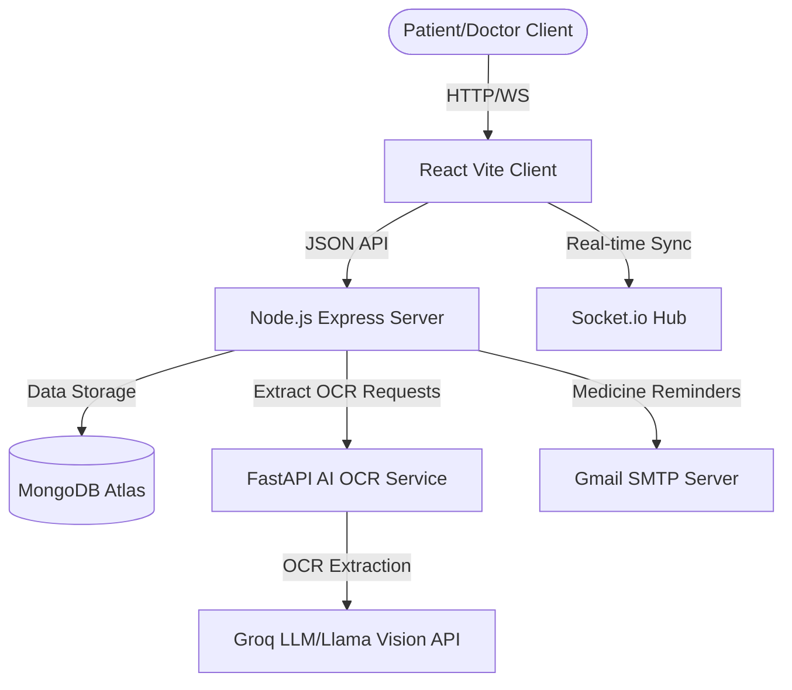

# HEALTHEASE — AI-Powered Healthcare SaaS Platform

[](https://react.dev)
[](https://nodejs.org)
[](https://expressjs.com)
[](https://mongodb.com)
[](https://tailwindcss.com)
[](https://socket.io)
[](https://fastapi.tiangolo.com)
[](https://opensource.org/licenses/MIT)

HEALTHEASE is a modern clinical SaaS workspace and patient compliance hub. It enables users to digitize handwritten prescriptions using advanced AI OCR extraction pipelines, log vitals, track daily medication schedules with compliance adherence meters, and connect with clinical doctor consults in real-time.

---

## Local Development

```bash
git clone https://github.com/Vardxn/Healthease.git
cd Healthease
npm install
npm run seed
npm run dev
```

### Application URLs:

- **Frontend**: http://localhost:3000
- **Backend**: http://localhost:5001

---

## Demo Credentials

### Admin:
- **Email**: admin@healthease.demo
- **Password**: Admin@123

### Patient:
- **Email**: user@healthease.demo
- **Password**: User@123

---

## 🏗️ Technical Architecture Diagram



---

## 🌟 Key Features

1. **AI Prescription OCR Scanner**
   - Upload handwritten doctor scripts and parse medicines, dosages, and schedules using advanced Groq Vision pipelines.
2. **Interactive Medication Adherence Tracker**
   - Daily calendars tracking taken/skipped doses with dynamic stock reminder warnings.
3. **Smart Health Score Engine**
   - Dynamic patient scoring (0-100) based on compliance stats, vitals logs consistency, and clinical consultation attendance.
4. **Telemedicine Marketplace**
   - Find clinical specialists, consult modes (video, audio, chat), verified ratings, and direct scheduling.
5. **PDF Report Engine**
   - Generate, preview, and download branded clinical reports for print and doctor reviews.
6. **Admin Dashboard**
   - Comprehensive metrics, audit feeds, and doctor licensing verifications.
7. **Real-time Updates**
   - Websocket synchronization tracking status changes, live doctor availabilities, and reminder warnings.

---

## 📁 Repository Directory Structure

```text
healthease/
├── client/                 # React + Vite + Tailwind CSS Frontend
│   ├── src/
│   │   ├── components/     # Reusable UI Cards, Modals, Forms
│   │   ├── context/        # Theme, Auth, Toast, WebSocket Contexts
│   │   ├── pages/          # Dashboard, HealthAssistant, ExportEngine, etc.
│   │   └── index.css       # Core design tokens configuration
├── server/                 # Express REST API Server
│   ├── controllers/        # Route business logic handlers
│   ├── models/             # Mongoose schemas (User, Prescription, Vitals)
│   └── index.js            # Node app entry point
├── python-service/         # FastAPI OCR Extractor Service
│   ├── main.py             # Groq Vision processing pipeline
│   └── requirements.txt
└── scripts/                # Start scripts for local MERN setup
```

---

## ⚙️ Environment Configuration

### Server (`/server/.env`)
```env
PORT=5001
MONGO_URI=mongodb://127.0.0.1:27017/healthease
JWT_SECRET=healthease_secret_key
PYTHON_SERVICE_URL=http://localhost:8000
GMAIL_USER=smtp.reminders@gmail.com
GMAIL_APP_PASSWORD=xxxx-xxxx-xxxx-xxxx
CLIENT_URL=http://localhost:3000
```

### AI Python Service (`/python-service/.env`)
```env
PORT=8000
MONGO_URI=mongodb://127.0.0.1:27017/healthease
GROQ_API_KEY=gsk_xxxxxxxxx
```

### Client (`/client/.env`)
```env
VITE_API_URL=http://localhost:5001/api
VITE_WS_URL=http://localhost:5001
```

---

## 📄 License
This project is licensed under the MIT License - see the [LICENSE](LICENSE) file for details.
