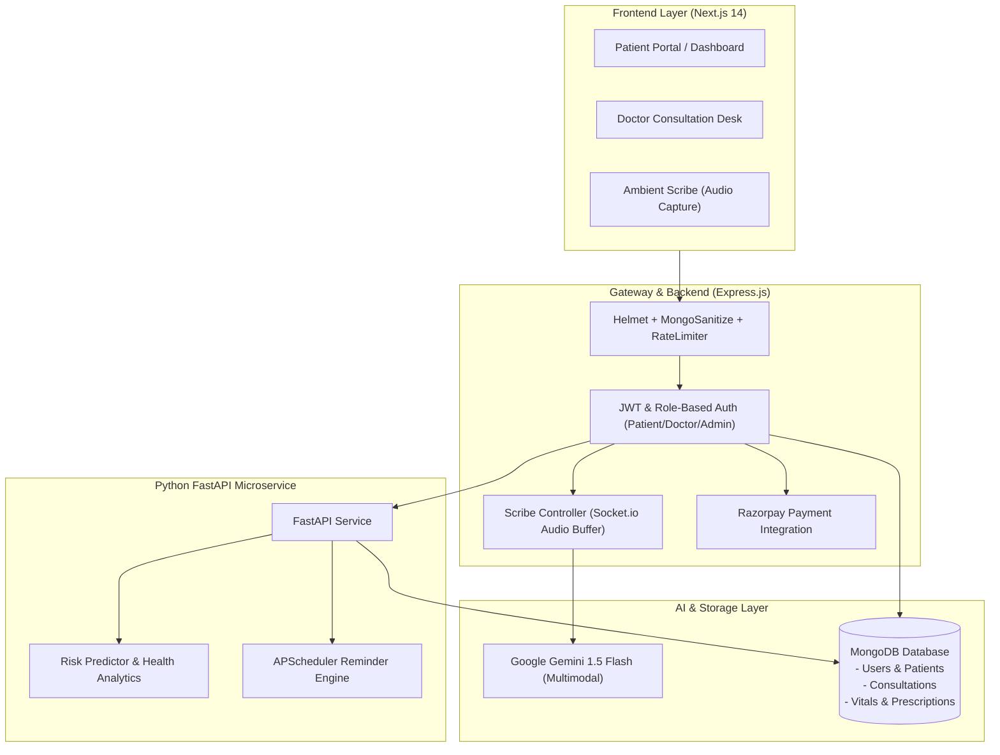

# HealthEase 🩺

**AI-Powered Healthcare Teleconsultation, Clinical Scribe & Prescription Platform**

[](https://nextjs.org/)
[](https://nodejs.org/)
[](https://fastapi.tiangolo.com/)
[](https://mongodb.com/)
[](https://deepmind.google/technologies/gemini/)
[](https://www.docker.com/)

---

## 📌 Problem & System Overview

Clinical documentation, prescription digitization, and rural healthcare triage in India suffer from major friction:
- Physicians spend substantial time writing manual clinical notes instead of focusing on direct patient interaction.
- Code-mixed dialogue (Hinglish) is poorly handled by conventional speech-to-text systems.
- Patient health records and vitals tracking are fragmented across paper prescriptions and disconnected clinics.

**HealthEase** is a service-oriented healthcare platform featuring:
- **AI Ambient Clinical Scribe:** Audio streaming via WebRTC/Socket.io that transcribes doctor-patient consultations and parses clinical summaries, symptoms, and structured medications using Google Gemini 1.5 Flash.
- **Microservices Backend:** An **Express.js API Gateway** managing authentication, RBAC (Patient, Doctor, Admin), appointment scheduling, and Razorpay billing, paired with a dedicated **Python FastAPI** microservice for risk prediction and background reminder jobs.
- **Prescription OCR & Parsing:** Extracts medication schedules, dosage, and diagnostic details from uploaded prescription images.
- **Enterprise Security:** Hardened with Helmet, Mongo-Sanitize, rate-limiting tiers, and automated integration security tests.

---

## 🏗️ Architecture


```mermaid
flowchart TD
    subgraph Client ["Frontend Layer (Next.js 14)"]
        PAT["Patient Portal / Dashboard"]
        DOC["Doctor Consultation Desk"]
        SCRIBE_UI["Ambient Scribe (Audio Capture)"]
    end

    subgraph API ["Gateway & Backend (Express.js)"]
        AUTH["JWT & Role-Based Auth (Patient/Doctor/Admin)"]
        SEC["Helmet + MongoSanitize + RateLimiter"]
        SCRIBE_SRV["Scribe Controller (Socket.io Audio Buffer)"]
        PAY["Razorpay Payment Integration"]
    end

    subgraph ML ["Python FastAPI Microservice"]
        FAST["FastAPI Service"]
        PRED["Risk Predictor & Health Analytics"]
        SCHED["APScheduler Reminder Engine"]
    end

    subgraph External ["AI & Storage Layer"]
        GEMINI["Google Gemini 1.5 Flash (Multimodal)"]
        MONGO[("MongoDB Database\n- Users & Patients\n- Consultations\n- Vitals & Prescriptions")]
    end

    Client --> SEC
    SEC --> AUTH
    AUTH --> SCRIBE_SRV
    AUTH --> PAY
    SCRIBE_SRV --> GEMINI
    AUTH --> FAST
    FAST --> PRED
    FAST --> SCHED
    AUTH --> MONGO
    FAST --> MONGO
```

---

## 🚀 Core Features & Modules

### 1. Ambient AI Medical Scribe
- **Live Consultation Recording:** Doctors record consultations in real-time. Audio streams are buffered and submitted to Gemini 1.5 Flash.
- **Structured JSON Prescription Generation:** Extracts patient chief complaints, clinical observations, diagnosis, and prescription line items (dosage, frequency, duration) formatted as structured JSON.
- **Code-Mixed Language Handling:** Designed to support English, Hindi, and colloquial Hinglish clinical terms.

### 2. Multi-Role Healthcare Management (RBAC)
- **Patient Dashboard:** View medical history, track daily vitals (heart rate, blood pressure, SpO2), manage active medication reminders, and schedule appointments.
- **Doctor Consultation Desk:** Real-time patient queues, electronic health record (EHR) review, direct vitals entry, and video teleconsultation rooms.
- **Admin Control:** System analytics, user verification, and operational logs.

### 3. FastAPI Analytics & Scheduling Engine
- Background health risk score calculations based on submitted patient vitals and health history.
- Automated medicine schedule notifications and appointment reminders via Nodemailer and background schedulers.

### 4. Security & Defensive Engineering
- **Authorization Enforcement:** Patient consultation endpoints enforce token-based identity checks to prevent cross-account tampering.
- **Defensive Middleware:** Uses `helmet` for HTTP security headers, `express-mongo-sanitize` to prevent NoSQL query injection, and tiered rate limiters (`express-rate-limit`) protecting auth and AI routes.

---

## 📂 Repository Structure

```
healthease/
├── client/                        # Next.js 14 App Router Frontend
│   ├── app/                       # App Router routes (login, signup, dashboard, doctor, admin)
│   ├── components/                # Reusable UI components & doctor forms
│   └── lib/                       # API clients and utility functions
├── server/                        # Express.js REST API Backend
│   ├── controllers/               # Auth, Doctor, Consultation, Scribe, Prescription controllers
│   ├── middleware/                # Rate limiters, Helmet, MongoSanitize, JWT Auth
│   ├── models/                    # Mongoose schemas (User, Patient, Doctor, Consultation, Vitals)
│   ├── routes/                    # API endpoints
│   ├── services/                  # EmailService, OCR, Gemini parser
│   └── tests/                     # Security and consultation unit/integration tests
├── python-service/                # Python FastAPI Microservice
│   ├── main.py                    # FastAPI server for risk prediction
│   ├── analytics/                 # Patient health analytics
│   └── reminders/                 # Background reminder scheduler
├── docs/                          # Architecture diagrams, sequence flows, ER diagrams
├── docker-compose.yml             # Orchestration for Client, Server, ML Service, and MongoDB
└── .github/workflows/ci.yml       # GitHub Actions CI build & verification workflow
```

---

## ⚙️ Setup & Local Development

### Prerequisites
- Node.js 18+ or 20+
- Python 3.10+
- MongoDB instance (local or MongoDB Atlas)
- Docker & Docker Compose (optional)

### 1. Environment Configuration

Create `.env` in `server/`:
```ini
PORT=5001
MONGO_URI=mongodb://localhost:27017/healthease
JWT_SECRET=your_jwt_secret_key
GEMINI_API_KEY=your_gemini_api_key
```

Create `.env` in `python-service/`:
```ini
PORT=8000
MONGO_URI=mongodb://localhost:27017/healthease
```

### 2. Running with Docker Compose
```bash
docker-compose up --build
```

### 3. Running Manually

**Start Backend Server:**
```bash
cd server
npm install
npm run dev
```

**Start Python Service:**
```bash
cd python-service
python3 -m venv venv
source venv/bin/activate
pip install -r requirements.txt
uvicorn main:app --port 8000 --reload
```

**Start Next.js Client:**
```bash
cd client
npm install
npm run dev
```

---

## 🧪 Testing & Verification

```bash
# Run Server Jest Security Test Suite
cd server
npm test

# Typecheck Client
cd ../client
npx tsc --noEmit
```
