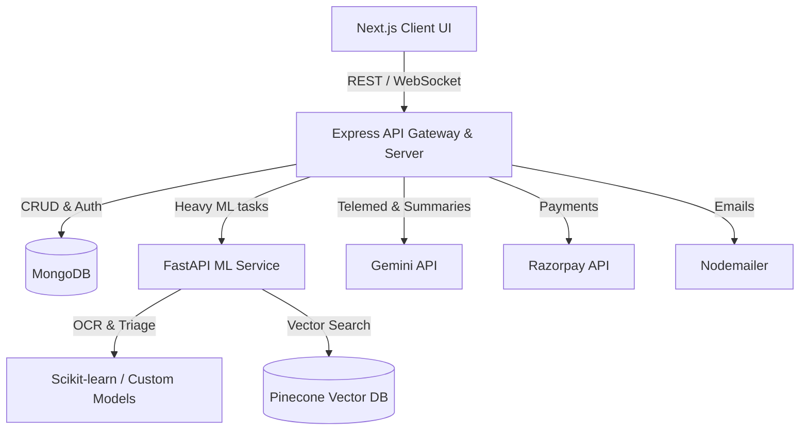

# HEALTHEASE 🩺
### AI-Powered Healthcare Platform for India

*A comprehensive digital health ecosystem that eliminates administrative burnout through AI-driven clinical documentation (Scribe), intelligent symptom triage, and seamless teleconsultations.*

 

## 🚀 Architecture Overview

HealthEase uses a robust Service-Oriented Architecture (SOA) split across a Next.js SSR frontend, an Express API Gateway, and a dedicated Python FastAPI service for heavy ML tasks.

```mermaid
graph TD
    Client[Next.js Client UI] -->|REST / WebSocket| Gateway[Express API Gateway & Server]
    Gateway -->|CRUD & Auth| MongoDB[(MongoDB)]
    Gateway -->|Heavy ML tasks| MLService[FastAPI ML Service]
    Gateway -->|Telemed & Summaries| Gemini[Gemini API]
    Gateway -->|Payments| Razorpay[Razorpay API]
    Gateway -->|Emails| NodeMailer[Nodemailer]
    
    MLService -->|OCR & Triage| MLModels[Scikit-learn / Custom Models]
    MLService -->|Vector Search| Pinecone[(Pinecone Vector DB)]
```

## ✨ Core Features

| Feature | Description | Tech Stack |
|---------|-------------|------------|
| **AI Medical Scribe (Hinglish Support)** | Live audio transcription of doctor-patient consultations, intelligently structured into prescriptions via LLMs. Supports code-mixed Hindi & English. | Socket.io, Gemini API, Next.js |
| **Intelligent Symptom Triage** | AI-driven patient symptom analysis that automatically flags severe cases for urgent escalation. | FastAPI, Scikit-learn, Express |
| **FHIR-Compliant Exports** | Medical records can be exported in the enterprise-standard FHIR JSON format for interoperability. | Node.js, MongoDB |
| **Teleconsultation Suite** | WebRTC-powered video/audio rooms with integrated payment gateways and live chat. | Razorpay, WebRTC |
| **Predictive Analytics** | Disease prediction and medicine classification powered by custom ML models. | Python, Pandas, Joblib |

## 🛠 Verified System Metrics
- **Endpoints:** ~150+
- **Database Models:** 14 (MongoDB)
- **Microservices:** 3
- **Third-Party Integrations:** 5+
