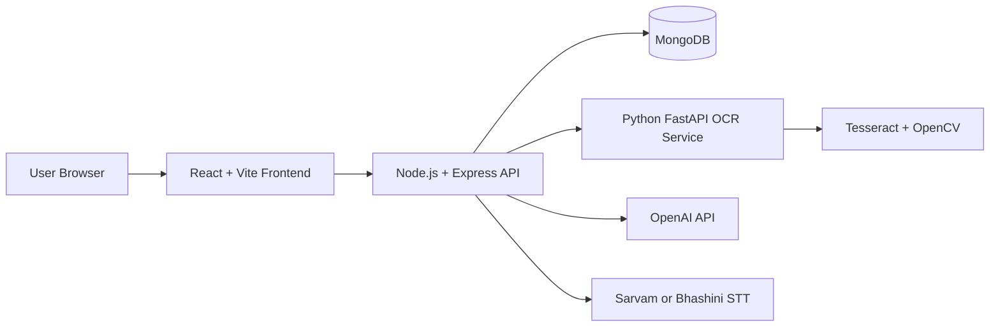
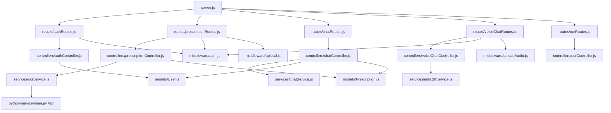
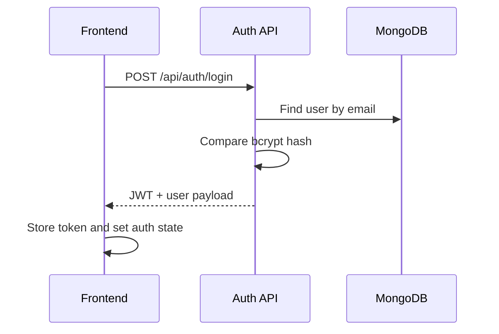
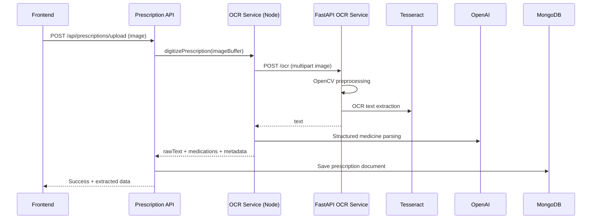
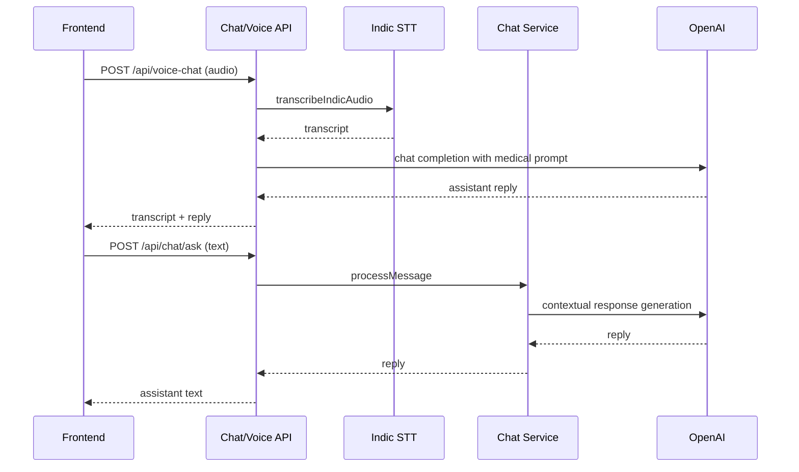

# HealthEase Technical Architecture

## 1. Objective
This document explains the technical architecture of HealthEase for engineering reviews, interviews, and technical presentations.

## 2. System Overview
HealthEase is a full-stack web platform with:
- React frontend for user interaction.
- Express backend API for auth, prescriptions, OCR, and chat.
- MongoDB for user and prescription persistence.
- Python FastAPI OCR microservice with OpenCV preprocessing and Tesseract extraction.
- OpenAI integrations for prescription structuring and assistant responses.

## 3. High-Level Architecture

## 4. Deployment Topology
- Frontend is built with Vite and served as static assets.
- Backend is an Express app that can run as:
  - Local Node server.
  - Vercel serverless function via server/api/index.js.
- Vercel routing sends /api/* traffic to backend and everything else to frontend index route.

## 5. Backend Module Architecture

## 6. Frontend Composition
- App shell: router, navbar, page container, chatbot widget.
- Pages:
  - Dashboard
  - Login
  - Register
  - Upload Prescription
  - Prescription List
  - Profile
- Cross-cutting state: AuthContext (token + user profile + auth actions).
- API layer: Axios instance with interceptor for Authorization bearer token.

## 7. API Surface
### Auth
- POST /api/auth/register
- POST /api/auth/login
- GET /api/auth/me (private)
- PUT /api/auth/profile (private)

### Prescriptions
- POST /api/prescriptions/upload (private, multipart image)
- GET /api/prescriptions (private)
- GET /api/prescriptions/:id (private)
- PUT /api/prescriptions/:id (private)
- DELETE /api/prescriptions/:id (private)

### AI Chat
- POST /api/chat/ask (private)
- GET /api/chat/context (private)

### Voice Chat
- POST /api/voice-chat (private, multipart audio)

### OCR (public utility)
- POST /api/ocr/handwriting (multipart image)

### Health
- GET /health
- GET /api/health

## 8. Data Model
### User
- name, email, passwordHash
- role (patient, doctor, admin)
- profile:
  - age
  - bloodGroup
  - chronicConditions[]
  - allergies[]

### Prescription
- patientId (ref User)
- imageUrl
- uploadDate
- medications[]:
  - name
  - dosage
  - frequency
  - duration
- doctorName
- ocrRawText
- isVerified
- notes

## 9. Core Request Flows
### 9.1 Auth Flow

### 9.2 Prescription Upload + OCR Flow

### 9.3 Chat and Voice Flow

## 10. Security and Middleware Design
- JWT auth middleware validates bearer token and injects req.user.
- Upload middleware validates media MIME and file size constraints.
- Error handling maps upload validation errors to clear API messages.
- Secrets are sourced from environment variables, not hardcoded in logic.

## 11. Reliability and Fallback Strategy
- Node OCR service calls Python OCR over HTTP with timeout handling.
- OCR service supports demo and fallback modes if Python OCR or OpenAI output is unavailable.
- Chat service also supports demo response mode when OpenAI key is absent.
- Health endpoints provide quick operational checks.

## 12. Key Engineering Talking Points (Interview-Friendly)
- Clear separation of concerns: routes, controllers, services, models, middleware.
- Context-aware assistant design using user profile and recent prescriptions.
- Multi-modal assistant support: text + voice + prescription image pathways.
- Progressive resilience with fallback logic for external API dependency failures.
- Scalable extension points for reminders, role-based workflows, and analytics.

## 13. Known Improvement Opportunities
- Add request validation library (Joi/Zod/express-validator) for strict payload contracts.
- Add structured logging and distributed trace IDs.
- Add automated tests (unit + integration + API contract tests).
- Move image storage from placeholder URL to durable object storage (S3/Cloudinary).
- Introduce role-based authorization enforcement beyond basic role field presence.
