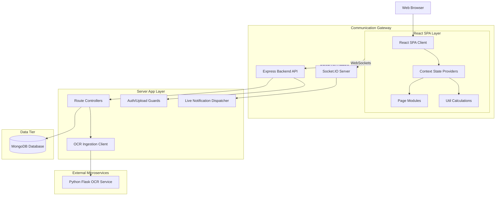
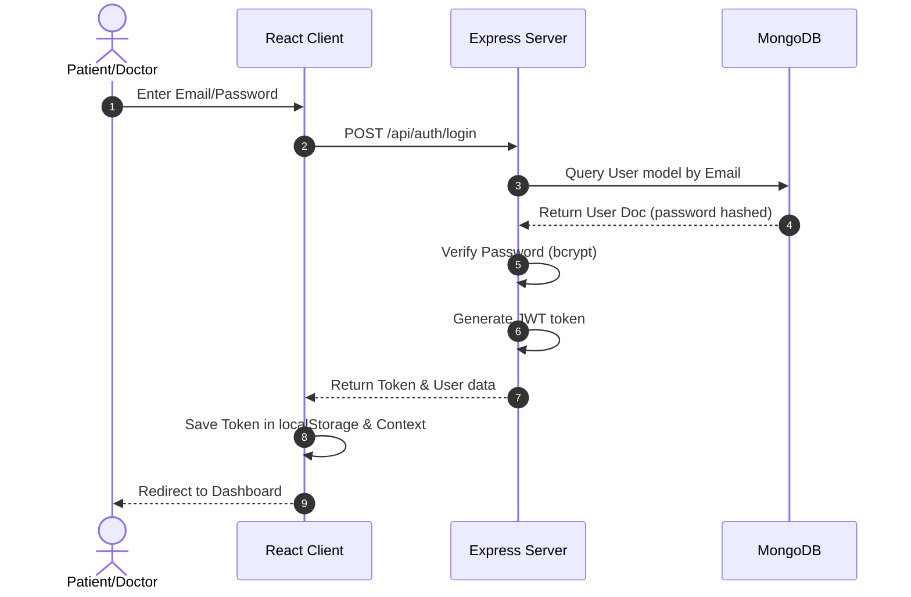
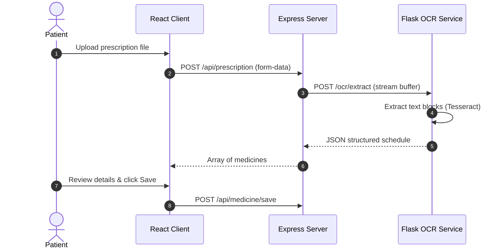

# HEALTHEASE Developer Handbook

This handbook is the definitive technical manual for developers on the HEALTHEASE platform. It outlines the platform's systems design, data pipelines, module interactions, and core developer workflows.

---

## PART 1: System Overview

### The Problem
Patients struggle to manage fragmented medical histories, understand handwritten prescriptions, comply with medication times, and keep track of telemetry logs (vitals). 

### The Solution
HEALTHEASE consolidates these vectors into a design-forward SaaS layout. It provides:
1. Automated OCR prescription readers.
2. An algorithmic **Smart Health Score Engine** tracking compliance.
3. Real-time notifications and an interactive AI Companion.
4. Integrated Doctor booking and telehealth queues.

### Workflows
- **Patient Workflow**: Sign in -> Upload Prescriptions -> Track medication schedules -> Log daily vitals -> Review health score -> Book consultation rooms.
- **Doctor Workflow**: Register professional credentials -> Undergo admin approval -> Filter client bookings -> Compile diagnostic notes and update prescriptions.
- **Admin Workflow**: Access verification portals -> Toggle approval values -> Review system statistics.

---

## PART 2: Complete System Architecture



---

## PART 3: Frontend Architecture

The React client compiles under Vite. Layout components and routing guards define page rendering.

### Folder Mapping
- `client/src/App.jsx`: Root component registering Protected Routes, App Context bounds, and SPA routes.
- `/components`: Houses layout components (e.g., `SidebarLayout.jsx`, `Navbar.jsx`) and reusable UI buttons, inputs, and cards.
- `/context`: Sets up contexts (`AuthContext.jsx`, `NotificationContext.jsx`, `WebSocketContext.jsx`) managing application-wide state.
- `/pages`: Contains modular view layouts (`Dashboard.jsx`, `VitalsDashboard.jsx`, `MedicineTracker.jsx`, `HealthScore.jsx`, `HealthAssistant.jsx`).
- `/utils`: Holds `healthScoreEngine.js` for on-the-fly metric calculations.

---

## PART 4: Backend Architecture

The server runs on Node.js using Express.

### Execution Layers
1. `routes/`: Receives request paths, applying JWT verification middleware.
2. `controllers/`: Directs payloads, calls model interfaces, and sends responses.
3. `models/`: Mongoose schemas defining MongoDB structures.
4. `middleware/`: Houses auth validators (`auth.js`) and file upload handlers (`upload.js`).
5. `services/`: Interfaces with the database and proxy targets (e.g. Flask OCR service).

---

## PART 5: Database Design

### Mongoose Schemas

#### 1. User
- **Fields**: `name` (String), `email` (String, Unique), `password` (String, Hashed), `role` (Enum: `patient`, `doctor`, `admin`), `createdAt` (Date).
- **Ownership**: Master account entry.

#### 2. Doctor
- **Fields**: `userId` (Ref: User), `specialization` (String), `licenseNumber` (String), `isApproved` (Boolean), `consultationFee` (Number).
- **Ownership**: Belongs to a User account with role `doctor`.

#### 3. Patient
- **Fields**: `userId` (Ref: User), `dateOfBirth` (Date), `gender` (String), `bloodGroup` (String).
- **Ownership**: Belongs to a User account with role `patient`.

#### 4. Medicine
- **Fields**: `patientId` (Ref: User), `name` (String), `dosage` (String), `frequency` (String), `startDate` (Date), `endDate` (Date), `status` (Enum: `active`, `paused`, `completed`, `stopped`).
- **Ownership**: Owned by the Patient.

#### 5. MedicineReminder
- **Fields**: `medicineId` (Ref: Medicine), `reminderTime` (String, e.g. "08:00"), `status` (Enum: `pending`, `taken`, `skipped`, `missed`), `date` (Date).
- **Ownership**: Child record of Medicine.

#### 6. Consultation
- **Fields**: `patientId` (Ref: User), `doctorId` (Ref: User), `scheduledAt` (Date), `status` (Enum: `queued`, `active`, `completed`, `cancelled`), `notes` (Object).
- **Ownership**: Shared reference between Patient and Doctor.

#### 7. VitalsLog
- **Fields**: `patientId` (Ref: User), `recordedAt` (Date), `bloodPressure` (String), `bloodSugar` (String), `spo2` (Number), `weight` (Number), `source` (String).
- **Ownership**: Owned by the Patient.

---

## PART 6: Authentication Data Flow

HEALTHEASE uses stateless JWT token validation.



- **Protected Routes**: Custom guards check `isAuthenticated` in `AuthContext` before mounting pages.
- **Logout**: Clears `localStorage` and resets context parameters.

---

## PART 7: OCR Prescription Flow



- **Fallback**: If the OCR backend is offline, the client falls back to a simulated mock dataset to ensure application testing remains uninterrupted.

---

## PART 8: Medicine Tracker Flow

1. **Medicine Creation**: Input parameters are posted to `/api/medicines`.
2. **Reminder Generation**: The server automatically calculates the number of doses based on start/end dates and frequency, generating individual `MedicineReminder` entries in the database.
3. **Adherence Calculations**: Ratio is derived from checkoffs: `taken / total`.
4. **Health Score Contribution**: Adherence points contribute up to 25% of the overall Health Score.

---

## PART 9: Consultation Flow

```
[Filter Specialists] -> [Submit Booking Details] -> [Create Consultation (queued)] 
                     -> [Doctor starts session] -> [Consultation (active)] 
                     -> [Doctor logs notes/prescriptions] -> [Consultation (completed)]
```

---

## PART 10: Vitals Flow

1. **Vitals Ingest**: Patient saves vitals logs manually or via wearable mocks.
2. **Persistence**: Writes entries directly to `vitals` schema.
3. **Visualizations**: History arrays compile on the client and render via Recharts.
4. **Health Score Integration**: Calculated dynamically based on the latest metrics.

---

## PART 11: Notification Flow

Live notification signals are dispatched across pages using Socket.IO.

```
[Express Server Action] ──> [Socket.IO Event] ──> [NotificationContext] 
                                                        │
    ┌───────────────────────────────────────────────────┴───────────────────────────────────────────────────┐
    ▼                                                                                                       ▼
[Toast Popup Alert]                                                                                 [localStorage Backup]
```

---

## PART 12: Health Score Engine

The Engine compiles data on-the-fly, returning a score (0 - 100).

$$\text{Health Score} = \text{Medication Adherence (25\%)} + \text{Consultation Compliance (20\%)} + \text{BP Stability (15\%)} + \text{Sugar Stability (15\%)} + \text{Weight Consistency (10\%)} + \text{Logging Consistency (15\%)}$$

### Formula Parameters
- **Medication Adherence (25% Weight)**: Derived from active/completed medicine logs.
- **Consultation Compliance (20% Weight)**: Completed appointments / total scheduled.
- **BP Stability (15% Weight)**: Normal range systolic < 140 mmHg and diastolic < 90 mmHg.
- **Blood Sugar Stability (15% Weight)**: Normal range matches 70-140 mg/dL.
- **Weight Tracking (10% Weight)**: Confirms weight is recorded in the latest logs.
- **Logging Consistency (15% Weight)**: Evaluates vitals log count.

---

## PART 13: AI Assistant Flow

1. **Input Prompts**: Users input natural language queries.
2. **Context Assembly**: The page collects active medications, 30-day vitals, and the current health score.
3. **Prompt Enrichment**: Queries are enriched with the patient's context before processing.
4. **Output**: Returns responses (e.g., `"Your Health Score is 84 (Good). Improving medication adherence can increase it to 90+."`).

---

## PART 14: Admin Dashboard Flow

- **Admin Authentication**: Secure admin roles access `/admin`.
- **Doctor Verification**: Lists unapproved doctors. Clicking "Approve" sets `isApproved: true` to list them in the directory.
- **System Monitoring**: Analyzes user registries and doctor specialties.

---

## PART 15: State Management

HEALTHEASE uses React Contexts to manage application state.

| Context Provider | Monitored Data | Propagation Trigger |
| :--- | :--- | :--- |
| **`AuthContext`** | Active user credentials, login states, role routing. | Sign in, sign out, token verification. |
| **`ThemeContext`** | Dark / Light theme settings. | Toggling dark mode button. |
| **`NotificationContext`** | Live compliance alerts, notifications array. | Incoming Socket.IO triggers, reading notifications. |
| **`WebSocketContext`** | Socket connection instance, signaling events. | Backend connection setup/teardown. |

---

## PART 16: API Map

| Endpoint | Method | Purpose | Consumer Component | Response |
| :--- | :--- | :--- | :--- | :--- |
| `/api/auth/register` | POST | Registers user credentials. | `Register.jsx` | User object + JWT |
| `/api/auth/login` | POST | Authenticates user. | `Login.jsx` | User object + JWT |
| `/api/prescriptions/upload` | POST | Uploads image for OCR extraction. | `UploadPrescription.jsx` | Structured JSON meds list |
| `/api/medicines` | POST | Adds new medication schedule. | `MedicineTracker.jsx` | Created Medicine document |
| `/api/medicines/today-reminders`| GET | Fetches today's reminders. | `MedicineTracker.jsx`, `Dashboard.jsx` | Array of reminders |
| `/api/vitals` | POST | Logs patient vitals. | `VitalsForm.jsx` | Saved Vitals document |
| `/api/vitals` | GET | Fetches vital logs history. | `VitalsDashboard.jsx` | Array of Vitals logs |
| `/api/consultations/book` | POST | Schedules doctor appointment. | `DoctorDirectory.jsx` | Created Consultation document |

---

## PART 17: Application Startup

When `npm run dev:all` is executed:
1. **Backend Server Startup**: Sets up Express server on port 5000 and connects to MongoDB.
2. **Frontend React Mounting**: Vite compiles files and mounts `index.html`.
3. **Context Initialization**: `AuthContext` checks for tokens. If verified, user status updates.
4. **Dashboard Render**: Requests medicines, vitals, and consultations in parallel, computing the **Health Score** and rendering dashboard widgets.

---

## PART 18: Complete User Journey

```
[User Registration] ──> [Login] ──> [Upload Prescription Image] ──> [Review parsed Medicines] 
                                                                              │
    ┌─────────────────────────────────────────────────────────────────────────┘
    ▼
[Save Medications & Reminders] ──> [Book marketplace Doctor] ──> [Log daily Vitals] 
                                                                        │
    ┌───────────────────────────────────────────────────────────────────┘
    ▼
[Receive compliance Notifications] ──> [Review Health Score Trends] ──> [Download PDF Summary]
```

---

## PART 19: Engineering Decisions

- **Why MERN?**: Seamless integration between database, server, and client.
- **Why Context API?**: Provides simple, lightweight state management for notifications, themes, and sockets.
- **Why JWT?**: Stateless session management simplifies server processes.
- **Why LocalStorage?**: Saves settings (themes, validation tokens) on the client, ensuring settings persist across page reloads.

---

## PART 20: Maintenance Guide

### Seeding the Database
To reset the database and seed it with demo credentials (admin, patient, doctor):
```bash
cd server
npm run seed
```

### Adding a New Page
1. Create your component in `client/src/pages/NewPage.jsx`.
2. Open `client/src/App.jsx` and import your component.
3. Wrap it inside the `ProtectedRoute` layout:
   ```jsx
   <Route path="/new-page" element={<ProtectedRoute><NewPage /></ProtectedRoute>} />
   ```

### Debugging the Health Score Engine
If the health score is displaying unexpected values:
1. Locate [healthScoreEngine.js](file:///Users/vardxn/Developer/Healthease/client/src/utils/healthScoreEngine.js).
2. Insert breakpoints or console log statements to trace the points contribution values.
3. Verify that the medicine, vital logs, and consultations parameters are passed correctly as arrays.
