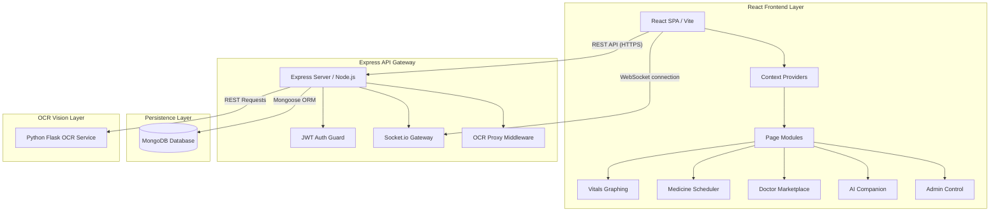
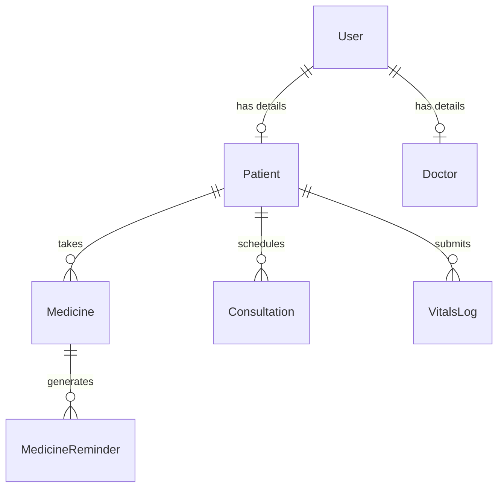
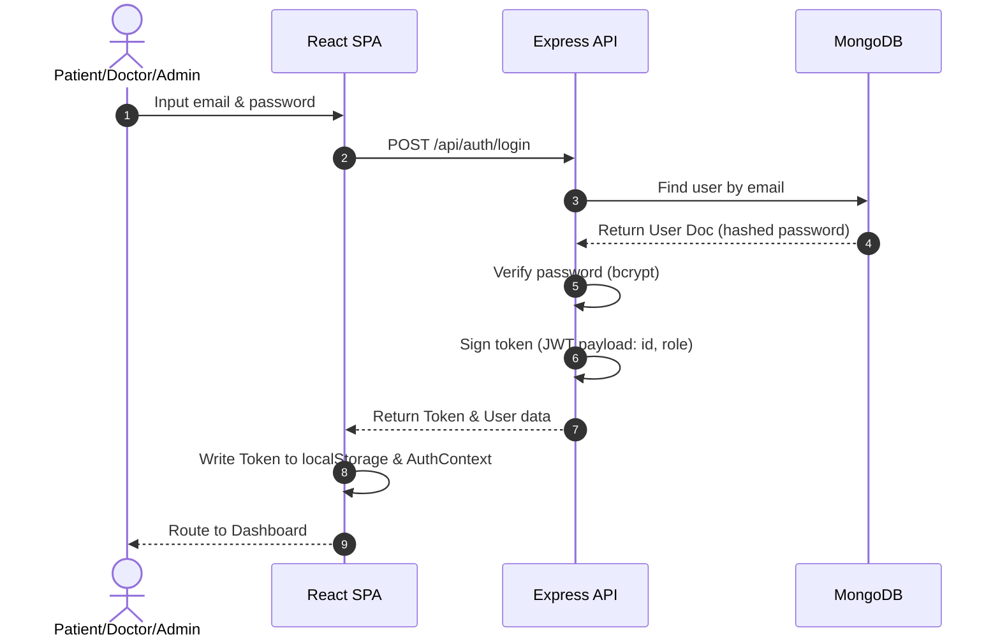
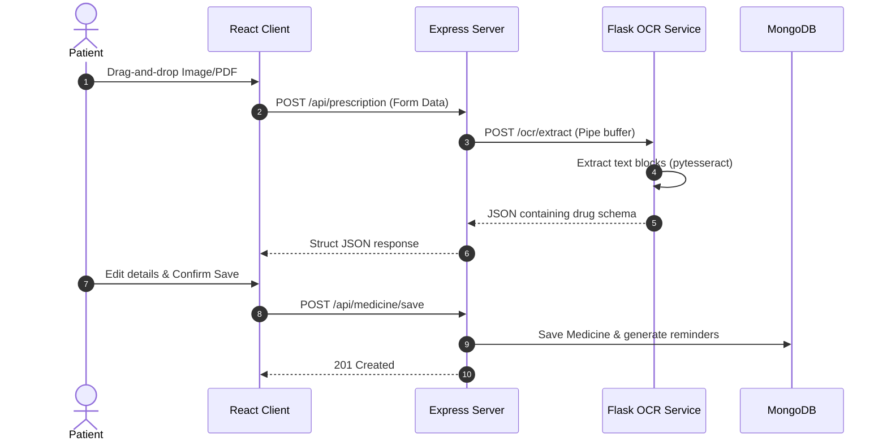
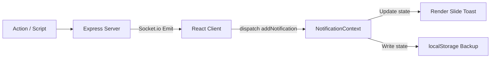

# HEALTHEASE Developer Architecture & Data Flow Guide

This document is the unified technical specification and developer onboarding manual for HEALTHEASE. It defines the systems design, data pipelines, module interactions, and core design choices of the application.

---

## SECTION 1: Project Overview

### What is HEALTHEASE?
HEALTHEASE is an intelligent, full-stack patient compliance-tracking, vital-telemetry, and telemedicine platform. It bridges the gap between passive healthcare monitoring and active treatment habits.

### Purpose
To provide patients with a single, design-forward dashboard to manage prescriptions, log health metrics, book consultations, and keep track of daily medication schedules. It provides clinicians and administrators with real-time compliance insights.

### Target Users
1. **Patients (Users)**: Log vitals, upload and parse prescriptions, receive compliance alerts, and schedule specialist calls.
2. **Doctors (Specialists)**: Manage patient appointments, register credentials, view vitals dashboards, and compile clinical summaries.
3. **Administrators**: Verify medical practitioner qualifications and monitor network analytics.

### Problems Solved
- **Adherence Failure**: Tracks daily doses and reports adherence points.
- **Fragmented Medical Logs**: Consolidated history timelines tracking weight, BP, glucose, and appointments.
- **Unstructured Prescription Forms**: Automated OCR parser converting papers into scheduler notifications.

---

## SECTION 2: High-Level System Architecture

Healthease utilizes a decoupled client-server architecture model.



---

## SECTION 3: Folder Structure

```
Healthease/
├── client/                 # React SPA (Vite + Tailwind CSS)
│   ├── src/
│   │   ├── components/     # Reusable layout and UI elements
│   │   ├── context/        # Auth, WebSockets, and Notification contexts
│   │   ├── pages/          # Dashboard, Vitals, Consultations, AI Assistant
│   │   └── utils/          # Health Score engine calculations
├── server/                 # Node.js + Express backend
│   ├── controllers/        # Route controllers (Auth, Vitals, Meds)
│   ├── models/             # Mongoose Schemas (User, Vitals, Consultation)
│   └── routes/             # Express API Endpoints
├── python-service/         # Flask + Tesseract OCR service
└── docs/                   # Systems design and screenshots index
```

### Folder Responsibilities
- `client/`: Handles the visual presentation, UI route tracking, rendering client charts, context management, and localized score calculations.
- `server/`: Exposes HTTPS endpoints, handles password hashing, issues JSON Web Tokens, manages MongoDB transactions, and interfaces with the Python OCR container.
- `python-service/`: A single-purpose microservice running Flask and Tesseract OCR, responsible for receipt reading and extracting medication text blocks.

---

## SECTION 4: Database Architecture



### Mongoose Schemas & Fields

#### 1. User
- **Purpose**: Central account record for credentials, logins, and session profile roles.
- **Fields**:
  - `name`: String (Required)
  - `email`: String (Required, Unique)
  - `password`: String (Required, Hashed)
  - `role`: String (`patient`, `doctor`, `admin`)
  - `createdAt`: Date
- **Relationships**: Parent record for Doctor and Patient models.

#### 2. Patient
- **Purpose**: Holds medical metadata specific to patient accounts.
- **Fields**:
  - `userId`: ObjectId (Ref: User)
  - `dateOfBirth`: Date
  - `gender`: String
  - `bloodGroup`: String
  - `emergencyContact`: String
- **Data Ownership**: Owned strictly by the corresponding User.

#### 3. Doctor
- **Purpose**: Holds professional credentials for marketplace listings.
- **Fields**:
  - `userId`: ObjectId (Ref: User)
  - `specialization`: String (Required)
  - `licenseNumber`: String (Required)
  - `experience`: Number
  - `isApproved`: Boolean (Defaults to false)
  - `consultationFee`: Number

#### 4. Medicine
- **Purpose**: Tracks active medication descriptions.
- **Fields**:
  - `patientId`: ObjectId (Ref: User)
  - `name`: String (Required)
  - `dosage`: String (Required)
  - `frequency`: String (Required)
  - `startDate`: Date
  - `endDate`: Date
  - `status`: String (`active`, `paused`, `completed`, `stopped`)

#### 5. MedicineReminder
- **Purpose**: Individual checklist entries for daily compliance ticks.
- **Fields**:
  - `medicineId`: ObjectId (Ref: Medicine)
  - `reminderTime`: String (e.g. "08:00")
  - `status`: String (`pending`, `taken`, `skipped`, `missed`)
  - `date`: Date

#### 6. Consultation
- **Purpose**: Logs telemedicine queues, video rooms, and medical diagnoses.
- **Fields**:
  - `patientId`: ObjectId (Ref: User)
  - `doctorId`: ObjectId (Ref: User)
  - `scheduledAt`: Date
  - `status`: String (`queued`, `active`, `completed`, `cancelled`)
  - `notes`: Object (Diagnosis text, ordered tests, prescribed drugs)

#### 7. VitalsLog
- **Purpose**: Saves telemetry records.
- **Fields**:
  - `patientId`: ObjectId (Ref: User)
  - `recordedAt`: Date
  - `bloodPressure`: String (e.g. "120/80")
  - `bloodSugar`: String (e.g. "105")
  - `spo2`: Number
  - `weight`: Number
  - `source`: String (`Manual`, `Wearable`)

---

## SECTION 5: Authentication Flow

HEALTHEASE uses standard stateless JWT tokens.



- **Protected Routes**: Custom Route Guards check `isAuthenticated` in `AuthContext`.
- **Logout**: Clears `localStorage` tokens and resets Context states.

---

## SECTION 6: OCR Prescription Flow



---

## SECTION 7: Doctor Marketplace Flow

1. **Doctor Listing**: Displays verified specialists matching the selected category.
2. **Filtering**: Refines searches dynamically by department and fees.
3. **Booking**: Posts custom date-time JSON payloads to create appointments.
4. **Active State**: Live consultations transition from `queued` to `active`, establishing real-time communication.

---

## SECTION 8: Medicine Tracker Flow

1. **Creation**: Medicine instances are initialized with daily frequency strings.
2. **Reminder Scheduler**: Express backend splits frequencies into individual `MedicineReminder` documents.
3. **Compliance Ratio**: Derived as `Taken / (Taken + Skipped + Missed)`.

---

## SECTION 9: Vitals Dashboard Flow

- **Entry**: Patients log systolic/diastolic BP, sugar (mg/dL), SpO2, and weight.
- **Analytics Graphing**: Raw logs are compiled on the client and mapped onto Recharts timelines.
- **Smart Score Integration**: The telemetry arrays feed the local calculation core.

---

## SECTION 10: Notification Flow

Live compliance messages are routed using contexts and sockets.



---

## SECTION 11: Health Score Engine

The Health Score calculates a composite compliance score (0 - 100).

$$\text{Health Score} = \text{Adherence (25\%)} + \text{Consultations (20\%)} + \text{BP Stability (15\%)} + \text{Sugar (15\%)} + \text{Weight (10\%)} + \text{Logging Consistency (15\%)}$$

### Metric Breakdown
- **Medication Adherence (25 Points)**: Evaluates active medicine statuses.
- **Consultations (20 Points)**: Completed consultation session ratio.
- **BP Stability (15 Points)**: Checks latest blood pressure reading.
- **Blood Sugar Stability (15 Points)**: Normal range matches 70-140 mg/dL.
- **Weight Tracking (10 Points)**: Score awarded if weight has been recorded in the latest logs.
- **Logging Consistency (15 Points)**: Awards points based on the total logs volume.

---

## SECTION 12: AI Assistant Flow

- **User Query**: Conversational prompt processed by the local helper.
- **Context Construction**: Reads current states (vitals array, active medications, health score).
- **Responses**: Returns answers tailored to the user's score (e.g., advising how to increase it above 90).

---

## SECTION 13: Admin Dashboard Flow

- **Approval Pipeline**: Admins review doctor credential registrations.
- **Specialist Verification**: Toggle approved values to list specialists in the marketplace.

---

## SECTION 14: State Management

Healthease uses the React Context API:
1. `AuthContext`: Manages logged-in user profiles.
2. `WebSocketContext`: Maintains Socket.IO listener loops.
3. `NotificationContext`: Dispatches compliance toasts.
4. `ThemeContext`: Handles light/dark mode variables.

---

## SECTION 15: API Architecture

- **`/api/auth`**: User registration, login sessions, and validation tokens.
- **`/api/prescriptions`**: Handles prescription image parsing and digitizing.
- **`/api/medicines`**: Saves medications, updates schedules, and compiles adherence.
- **`/api/vitals`**: Saves user vitals and fetches history arrays.
- **`/api/consultations`**: Creates appointments, edits statuses, and saves notes.

---

## SECTION 16: Dark Mode Architecture

- Custom tailwind settings support system switches.
- Active states persist using a `ThemeContext` backed by `localStorage` keys.

---

## SECTION 17: Error Handling & Resilience

- **Vision Service Offline**: If the python server is offline, the upload form falls back to simulated mock structures.
- **Reconnections**: WebSocket handlers reconnect automatically on network drops.

---

## SECTION 18: Application Startup Lifecycle

```
[npm run dev]
  |-- 1. Launch Express Server (Port 5000)
  |-- 2. Establish MongoDB Connection
  |-- 3. Launch Vite Dev Server (Port 5173)
  |-- 4. Load AuthContext (Check localStorage)
  |-- 5. Mount Client Routes (/dashboard, /vitals, /health-score)
```

---

## SECTION 19: End-to-End User Journey

```
[Register] -> [Login] -> [Upload Prescription Doc] -> [AI OCR Extracts Meds] 
           -> [Adherence Tracker Setup] -> [Book Appointment] -> [Log Daily Vitals] 
           -> [Review Health Score Trends] -> [Download PDF Report] -> [Logout]
```

---

## SECTION 20: Engineering Decisions

- **Why MERN?**: Single-language runtime across database models, controllers, and pages.
- **Why Context API?**: Replaces heavy state engines (e.g., Redux) for modular applications.
- **Why JWT?**: Stateless validation tokens reduce database load.
- **Why Tesseract?**: A lightweight open-source OCR engine ideal for parsing text structured in tables.
