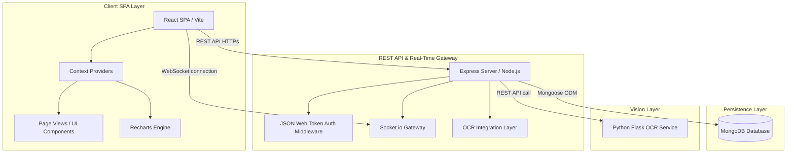
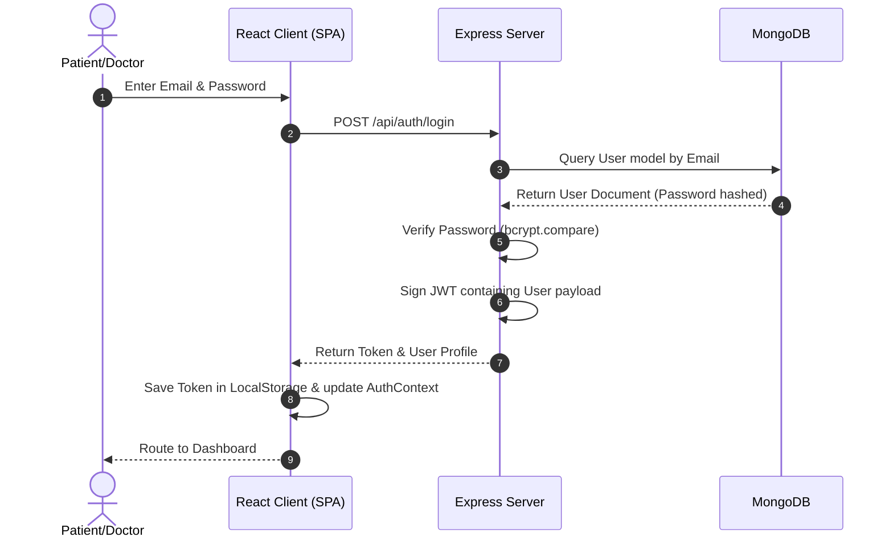
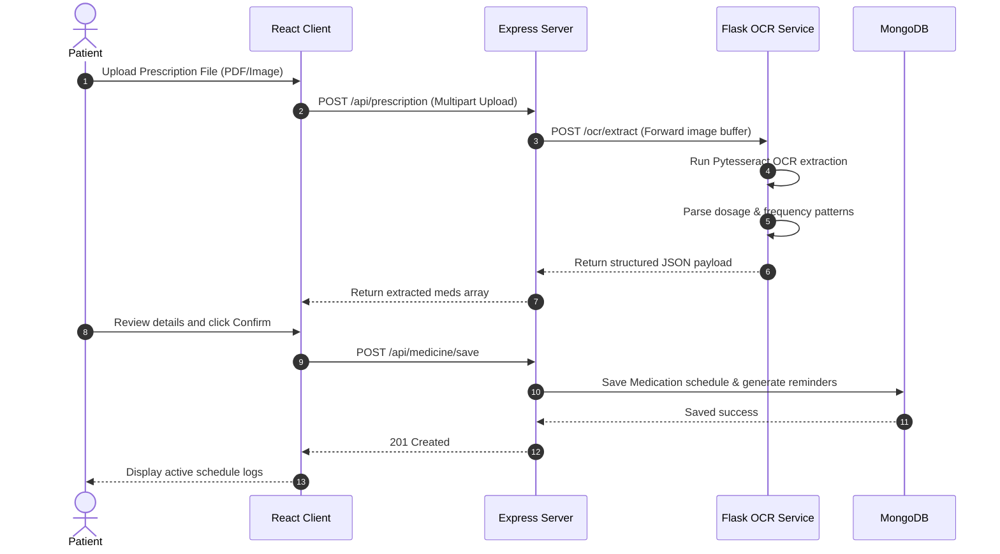
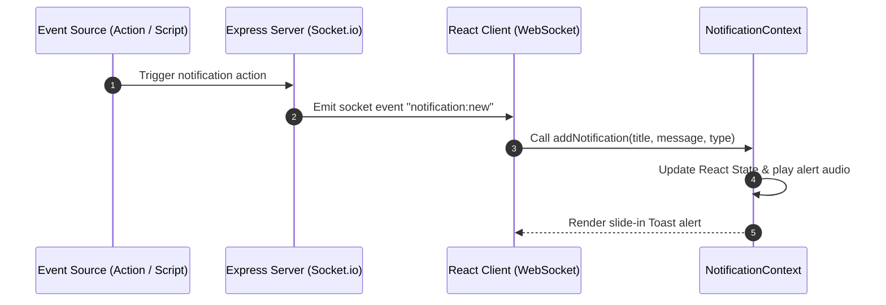
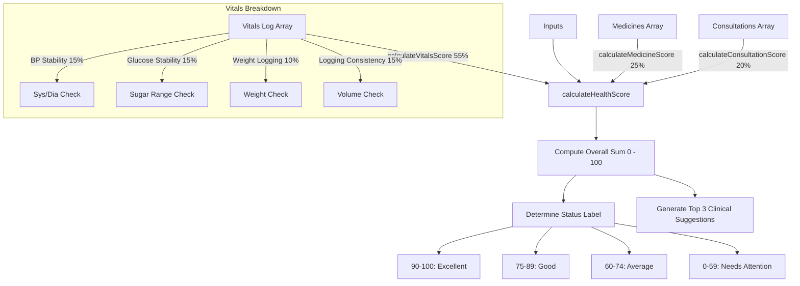

# HEALTHEASE Technical Architecture & Flows

This document details the systems design, layered architecture, database models, and critical logic flows within Healthease.

---

## 🏗️ Layered Architecture Overview

Healthease is built on a standard decoupled client-server architecture model.

---

## 🔐 Authentication Flow

Secure session management is handled via stateless JWT (JSON Web Tokens).

---

## 📄 OCR Prescription Reader Flow

Automated ingestion processes images and structures schedule parameters.

---

## 🔔 Notification Flow

Centralized real-time notifications triggered by in-app actions.

---

## 📈 Health Score Calculation Flow

Combines telemetry indexes and clinical actions dynamically inside the Health Score Engine.

